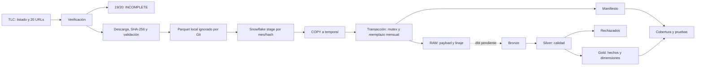

# Arquitectura objetivo

```mermaid
flowchart LR
    TLC["TLC: listado y 20 URLs"] --> V[Verificación]
    V --> R["19/20: INCOMPLETE"]
    V --> D["Descarga, SHA-256 y validación"]
    D --> P["Parquet local ignorado por Git"]
    P --> S["Snowflake stage por mes/hash"]
    S --> T["COPY a temporal"]
    T --> A["Transacción: mutex y reemplazo mensual"]
    A --> RAW["RAW: payload y linaje"]
    A --> M[Manifiesto]
    RAW -. "dbt pendiente" .-> B[Bronze]
    B --> Q["Silver: calidad"]
    Q --> X[Rechazados]
    Q --> F["Gold: hechos y dimensiones"]
    M --> C["Cobertura y pruebas"]
    F --> C
```

Bronze/Silver/Gold y la aceptación final están diseñados, pendientes de implementar.
Una descarga local no confirma una carga remota ni la finalización del ELT.
