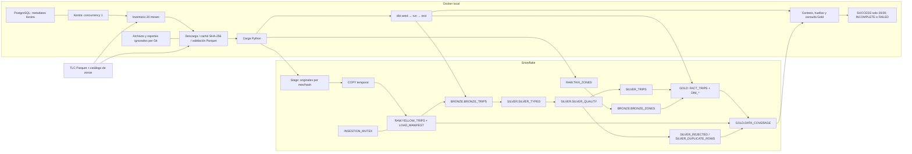

# Arquitectura implementada

Python y dbt CLI ejecutan localmente; datos, transformaciones y tests SQL corren
en Snowflake. No hay base Snowflake dentro de Docker. PostgreSQL solo almacena
la orquestación. dbt no proporciona publicación atómica de toda la estrella;
el estado final y sus pruebas determinan si la ejecución es aceptable.
