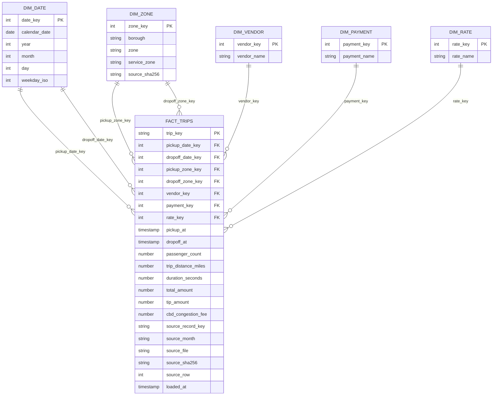

# Esquema estrella implementado

Grano del hecho: **una fila física válida de viaje**, aunque otra comparta sus
atributos de negocio. PK/FK son lógicas y tienen pruebas dbt. Fecha y zona tienen
dos roles. Los códigos desconocidos se conservan como atributos originales y se
asocian a -1 en sus dimensiones. Métricas adicionales y reglas en docs/design.md.
GOLD.DATA_COVERAGE es una tabla auxiliar de 20 meses; no cambia el grano del hecho.
