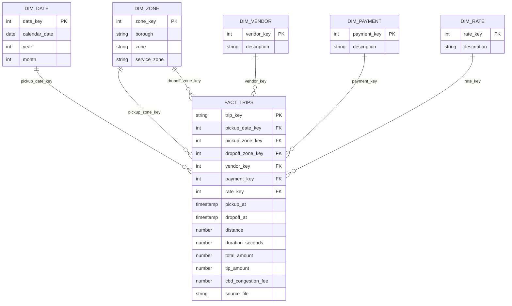

# Estrella propuesta (implementación dbt pendiente)

Grano: un viaje válido tras deduplicación exacta. Las dos zonas utilizan la misma
dimensión. Métricas, atributos adicionales y claves se describen en `docs/design.md`.
